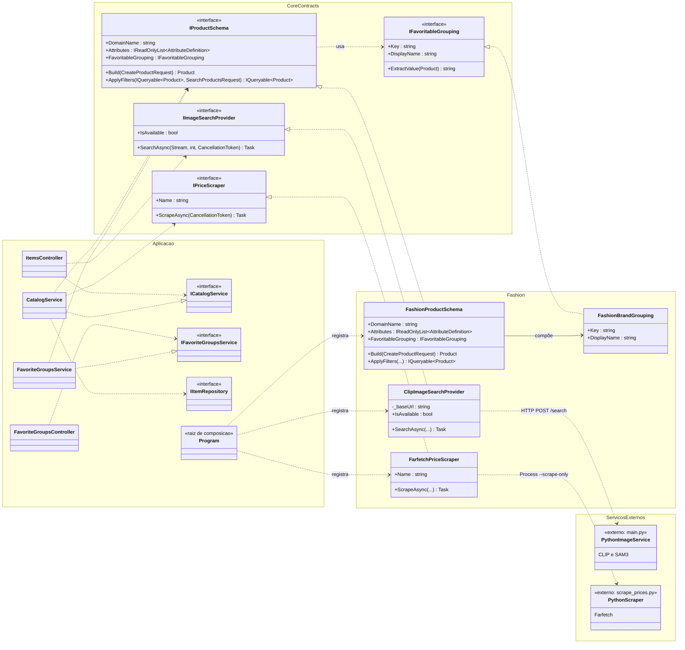

# Arquitetura do Framework — Archivé

Diagrama de classes (UML) do `Archive.API`, evidenciando a separação entre o
**núcleo congelado do framework** (estável, agnóstico de domínio) e o
**plugin de domínio** (`Fashion`), que implementa os pontos flexíveis.

## Como o framework funciona

- `Core/Contracts` define os **pontos flexíveis** (hot spots) como interfaces.
- `Fashion/` é um **plugin de domínio** que realiza essas interfaces. Trocá-lo por
  `Books`, `Electronics`, etc. produz outra aplicação **sem alterar o núcleo**.
- As camadas estáveis (`Controllers → Services → Repositories`) dependem **apenas
  das abstrações** (Inversão de Dependência).
- `Program.cs` é a **raiz de composição**: injeta as implementações `Fashion` via DI.
- O plugin `Fashion` apenas **encapsula** os serviços Python externos (CLIP+SAM e o scraper).

## Diagrama de classes

## Legenda da notação

| Notação | Significado |
|---|---|
| `<|..` (tracejada, triângulo vazado) | **Realização** — classe `Fashion` implementa a interface do `Core` |
| `..>` (tracejada, seta) | **Dependência** — "usa" / depende da abstração |
| `-->` (cheia, seta) | **Associação/composição** |
| `<<interface>>` | Estereótipo de interface (ponto flexível) |

> Substituir o pacote **Fashion** por outro domínio (ex.: `Books` com
> `BookProductSchema`, `AuthorGrouping`, etc.) gera uma nova aplicação reaproveitando
> todo o núcleo — é isso que caracteriza o **framework**.
